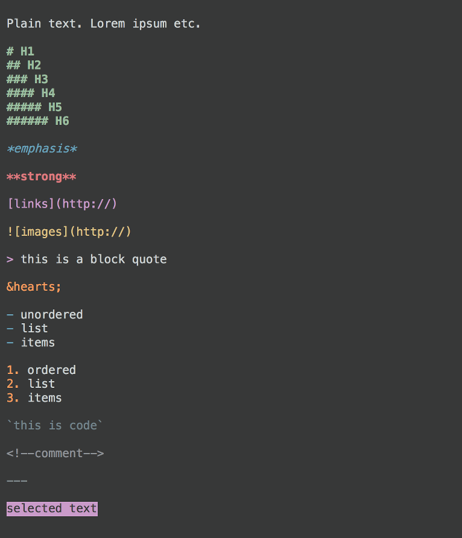

# New Moon — Custom Theme for Mou Markdown Editor

## [DOWNLOAD](New Moon.txt)

## About the Theme

**New Moon** is a custom theme for the [Mou](http://25.io/mou/) Markdown editor. This is *not* a custom style sheet and will not affect live preview or any HTML or PDF exports.

This theme is based on the lovely [New Moon text editor theme](http://taniarascia.github.io/new-moon/) by [Tania Rascia](http://www.taniarascia.com/) (*available for Atom, Sublime, and Brackets*). All I did was make a version for Mou. Credit for the name and color scheme all goes to Tania.

## How to Install

Installation couldn't be easier. Simply place the `New Moon.txt` file into this folder: `~/Library/Application Support/Mou/Themes` 

(*from your terminal, just copy and paste `open ~/Library/Application\ Support/Mou/Themes`*)

Then, open Mou and go to **Mou > Preferences > Themes** (*or ⌘,*)

Next to **Use Themes**, *New Moon* should appear as an option. Select it and it should be your new theme.

